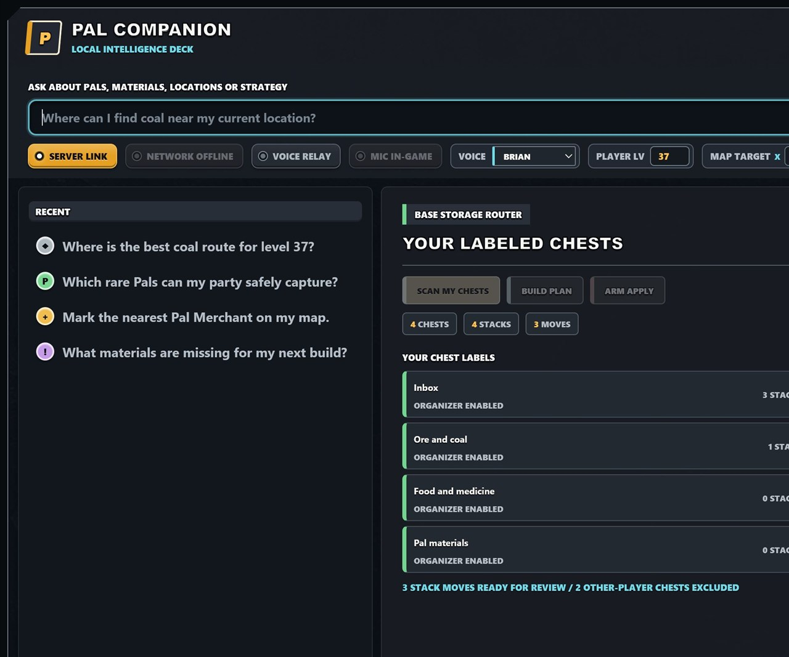

# Palworld Local LLM Companion

Local-first AI assistance for Palworld, grounded in real game data instead of guesses.
It combines Ollama, vector retrieval over user-provided game-data exports, optional
live server context, and web search for current guides and strategies.



The screenshot uses the inert `?demo=storage` documentation fixture. It demonstrates
the review flow and ownership exclusions without reading or moving live game items.

## What it answers

- Where a Pal, material, dungeon, or resource can be found
- Practical routes using in-game map coordinates and the current player level
- Capture, breeding, combat, and base-building strategies
- Live player positions from a server you administer
- Questions affected by recent patches, with web links

Every answer carries sources and a confidence level. When retrieval is weak, the
companion says it lacks evidence rather than inventing coordinates.

For Pal and location questions, the companion ranks documented level ranges against
the current player. It leads with one `LEVEL MATCH`, or clearly reports
`OVER YOUR LEVEL` when no verified compatible location exists. The client overlay
passes the player name for matching against live server context; the `PLAYER LV`
control provides a local fallback. Locations without level evidence remain explicitly
unverified rather than being labeled safe.

Repeated questions are served from a persistent SQLite answer cache. Local answers
remain reusable for seven days, web-backed answers for one hour, and live-server
answers for 15 seconds. Re-indexing game data clears cached answers automatically.

The pilot UI can automatically read answers aloud with selectable Microsoft Edge
neural voices through `edge-tts`, with no paid voice service or API key. Generated
MP3 files are cached privately so repeated answers play immediately. Read-aloud can
be disabled or stopped during generation or playback, including by typing
`stop talking`. The grounded model produces a separate short spoken briefing, so voice
playback leads with the answer and only the most useful action, location, or warning
instead of reading citations and exhaustive lists. Voice synthesis is an online
feature: the spoken briefing is sent to Microsoft's voice service, while game data,
credentials, and Ollama stay local.
Answers with map coordinates expose copy controls in a normal browser and local
Palworld marker controls when opened through the client-only UE4SS overlay.
The always-available `MAP TARGET` control also accepts an exact X/Y pair and places
a native custom marker, avoiding manual map panning.
In the in-game overlay, coordinate answers ask for confirmation. Saying `yes` (or
using the confirmation button) places them with a matching native marker category.
Enable `MIC CONFIRM` once to listen for a spoken yes/no only while that confirmation
is visible. Palworld acknowledges successful placement before the bundled marker
chime plays.
The local companion uses Windows' constrained speech grammar with the default
microphone, so the embedded game browser does not need microphone permission or a
speech AI model. It only recognizes the approved yes/no confirmation phrases.

## Surfaces

- `pal-companion ask "Where can I get coal?"`
- Local HTTP `POST /ask` for PAL COMMAND and overlays
- Discord `/askpal`
- In-game `F2` Paldeck overlay through the client-only UE4SS UI prototype
- In-game `F3` verified vendor directory with native markers and guild sharing
- In-game `F4` AI Storage Router for labeled, loaded base chests
- In-game `F5` Private Admin Supplies for items and self-only technology points

## Architecture

See [Architecture and data flow](docs/ARCHITECTURE.md) for dark-theme C4 and Mermaid
diagrams covering system boundaries, retrieval, generation, and credential isolation.

```text
Question
  |
  +-- local vector index (exported game tables and curated notes)
  +-- live Palworld REST context (optional, read-only)
  +-- Brave web search (optional, current strategies and patches)
  |
Evidence pack with source IDs
  |
Local Ollama model
  |
Answer + citations + confidence
```

Ollama provides both the local chat model and embeddings. The starter index uses
SQLite and cosine similarity so the system has no external database service. The
storage interface can later move to Qdrant or another vector database without changing
the answer pipeline.

## Quick start

Requirements: Python 3.11+, Ollama, and an Ollama chat and embedding model.

```powershell
git clone https://github.com/luibots/palworld-local-llm-companion
cd palworld-local-llm-companion
python -m venv .venv
.\.venv\Scripts\Activate.ps1
pip install -e ".[dev]"

ollama pull qwen2.5:3b
ollama pull embeddinggemma

Copy-Item .env.example .env
pal-companion ingest data\samples\pals.jsonl
pal-companion ask "What is Lamball?"
```

Run the API:

```powershell
pal-companion api
```

The default 3B model, 4096-token context, and 30-second keep-alive are tuned to
run beside Palworld on a 10 GB GPU. Larger models and long keep-alives can consume
most available VRAM and cause severe in-game frame-time spikes.

Open `http://127.0.0.1:8765/` for the Paldeck interface. The API issues a
same-origin session cookie to that UI; `/ask` rejects requests without it.

Keep the local API available for PAL COMMAND welcome messages even when Palworld
is not running:

```powershell
.\scripts\Install-CompanionServiceAutoStart.ps1
```

This installs the `PAL COMMAND - Companion Service` logon task. Its supervisor
restarts the loopback API after an unexpected exit. The local-only
`POST /internal/welcome-message` endpoint constructs contextual join messages
from the player name, server name, world day, online roster, and persistent visit
history. PAL COMMAND remains responsible for detecting joins and broadcasting the
returned message through Palworld.

### Index the installed game

On Windows, the local importer extracts selected Palworld data tables using the
PAL COMMAND toolchain, converts them to private JSON, and indexes the resulting
Pal, item, recipe, drop, spawn, build-object, and technology facts:

```powershell
.\scripts\Import-LocalGameData.ps1
```

By default, the script looks for `repak.exe`, `UAssetGUI.exe`, and `Mappings.usmap`
under `..\pal-command\tools`. Use `-ToolsDir C:\path\to\tools` when that checkout
is elsewhere.

The importer reads the Steam build ID and writes generated files only beneath
`data/private/` and `data/index/`. Both locations are ignored by Git. Run it again
after a Palworld update to rebuild the local evidence from the installed game. It
also indexes the small, attributed coordinate guides in `data/guides/`; these fill
route-planning gaps where static resource-node placements are not yet extracted
from the packaged world levels.

### Enable current web results

Ollama does not browse by itself. The companion performs a Brave Search first,
passes the returned snippets and URLs to Ollama as evidence, and displays those
links with the answer. Create a local `.env` from `.env.example`, then set:

```dotenv
BRAVE_SEARCH_API_KEY=your_subscription_token
```

Restart `pal-companion api` after changing `.env`. Keep this token in `.env`; do
not paste it into chat or commit it. The UI reports `WEB NOT CONFIGURED` until the
token is available.

## In-game Paldeck prototype

The UI prototype is client-only. It does not require a server mod or server restart.

1. Subscribe to
   [UE4SS Experimental (Palworld)](https://steamcommunity.com/workshop/filedetails/?id=3625223587)
   in Steam Workshop.
2. Launch Palworld, enable UE4SS in the in-game Mod Manager, then close Palworld.
3. Install the UI script:

   ```powershell
   .\scripts\Install-ClientMod.ps1
   ```

4. Start the companion locally with `pal-companion api`.
5. Launch Palworld and enter a world. Press `F2` for the companion, `F3` for
   the instant vendor directory, or `F4` for Storage Router.

The vendor directory is local catalog data and opens without waiting for Ollama.
When authorized live player coordinates are available, it sorts verified brokers by
straight-line map distance. `MARK ROUTE` places a native person marker through the
client bridge. `GUILD` queues a fixed vendor card for the PAL COMMAND Discord bot;
it does not allow arbitrary browser-authored announcements.

### Storage Router beta

Name participating chests in Palworld with labels such as `Inbox`, `Ore and coal`, `Food`,
`Pal materials`, or `Ammo`, then press `F4`. Storage Router scans item-storage
models currently loaded by your client and sends their labels and stack metadata to
the local companion. Ollama maps item IDs to those labels; deterministic category
rules remain available when the model is offline.

The bridge compares Palworld's replicated chest-builder UID with the current player's
UID. Only chests built by that player can enter the snapshot; guild members' chests
and unknown-owner chests fail closed before data reaches the planner. Unlabeled owned
chests are shown in the scan but excluded from the move plan. A label is the second
opt-in boundary for both sources and destinations.

The UI previews every move. Applying requires a second confirmation. Immediately
before submission, the UE4SS bridge rechecks chest ownership and verifies each source slot still exists,
contains the same item and at least the requested quantity, shares a base with the
destination, and targets a labeled chest from the most recent scan. Each apply is limited to 32 stack
moves and uses Palworld's replicated item-move request. The feature does not edit
save files, move items in the background, or route to unloaded containers.

### Private Admin Supplies beta

`F5` opens a self-only item and progression terminal in the in-game overlay. It is
disabled by default and cannot grant anything until the dedicated server has
PalDefender configured with a bearer token limited to `REST.Items.Give` and
`REST.Progression.Give`. The target player ID is fixed in the local `.env`; the
browser never accepts an arbitrary target. Progression controls support technology
points and Ancient Technology Points, not arbitrary player selection.

```dotenv
ADMIN_SUPPLIES_ENABLED=true
PALDEFENDER_URL=http://127.0.0.1:8213
PALDEFENDER_TOKEN=store-a-real-token-only-in-your-local-env
ADMIN_SUPPLY_PLAYER_ID=steam_your_private_id
ADMIN_SUPPLY_MAX_COUNT=999999
ADMIN_SUPPLY_MAX_PROGRESSION=10000
```

The companion sends one validated server request after a two-step confirmation. Item
grants remain subject to inventory capacity. It does not invoke Palworld's broadcast
endpoint or the Discord bot. PalDefender can still retain a private administrative log
on the server. Do not expose the PalDefender API directly to the Internet; use a
private tunnel or host firewall.

Do not install a second manual UE4SS copy alongside the Workshop version. The installer
refuses to modify Palworld until the official `Mods\NativeMods\UE4SS` path exists.

```http
POST http://127.0.0.1:8765/ask
Content-Type: application/json

{"question":"Where can I get coal?","allow_web":true,"include_live":true}
```

Run Discord after putting the token only in local `.env`:

```powershell
pal-companion discord
```

## Data ingestion

JSONL records use this shape:

```json
{"source_id":"items:coal","title":"Coal","text":"Verified facts and coordinates","kind":"game-data","url":null,"metadata":{"game_version":"1.0"}}
```

Do not commit extracted copyrighted game data. Keep raw exports under `data/private/`;
that directory and the generated vector index are ignored. Publish extraction code,
schemas, and tiny clearly labeled examples instead.

## Integration boundaries

- Live Palworld calls are read-only.
- The optional UI mod creates a UMG browser panel and handles confirmed local map
  markers and storage moves. Storage writes use Palworld's server-validated item RPC.
- Ollama and credentials remain in the separate local process.
- Credentials stay in `.env`, which Git ignores.
- Web claims remain labeled and linked; they do not silently override game-table data.
- Server and player information must not be submitted to public issue reports.

## Status

The first vertical slice is implemented: Ollama chat/embeddings, SQLite vector retrieval,
live player coordinates, Brave search, FastAPI, Discord, CLI, unit tests, an in-game
UE4SS Paldeck, and the guarded labeled-chest Storage Router beta. The Windows importer
builds a private index from installed
Palworld Pal, item, recipe, drop, wild-spawn, build-object, and technology tables.
Attributed 1.0 route guides provide precise resource coordinates while direct static
resource-node extraction and Workshop packaging remain future work.

## References

- [Ollama embeddings](https://docs.ollama.com/capabilities/embeddings)
- [Ollama API](https://docs.ollama.com/api/introduction)
- [Brave Search API](https://api-dashboard.search.brave.com/api-reference/web/search/get)
- [Discord application commands](https://docs.discord.com/developers/docs/interactions/slash-commands)
- [edge-tts](https://github.com/rany2/edge-tts)

## License

MIT. Palworld is a trademark of Pocketpair, Inc. This project is unofficial and is not
affiliated with or endorsed by Pocketpair.
