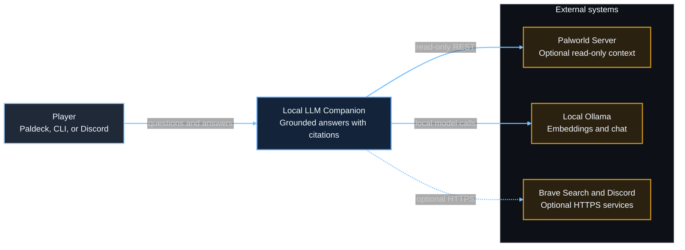
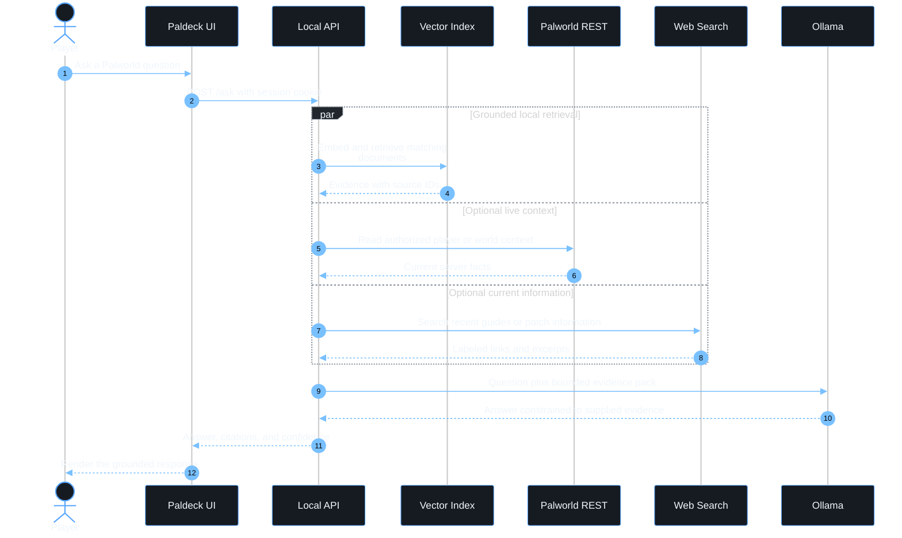

# Architecture and data flow

The companion is local-first. The browser or optional in-game panel talks only to the
loopback FastAPI service. Retrieval happens before generation so Ollama receives an
evidence pack with stable source identifiers instead of an ungrounded question.

## C4 system context

## Container view

```mermaid
%%{init: {"theme":"dark","flowchart":{"curve":"basis","htmlLabels":false,"nodeSpacing":55,"rankSpacing":75},"themeVariables":{"background":"#0d1117","primaryColor":"#161b22","primaryTextColor":"#f0f6fc","primaryBorderColor":"#58a6ff","lineColor":"#79c0ff","secondaryColor":"#21262d","tertiaryColor":"#30363d","clusterBkg":"#0d1117","clusterBorder":"#8b949e","fontFamily":"Segoe UI, Arial, sans-serif"}}}%%
flowchart LR
    subgraph SURFACES["Player surfaces"]
        direction LR
        GAME["F2 in-game Paldeck"]
        WEB["Local browser"]
        CLI["CLI and Discord"]
    end

    subgraph LOCAL["Local trust boundary"]
        direction LR
        UI["Static Paldeck UI"]
        API["FastAPI session-protected /ask"]
        RAG["RAG orchestrator"]

        subgraph SOURCES["Evidence sources"]
            direction LR
            INDEX[("SQLite vector index")]
            LIVE["Palworld REST read-only"]
            SEARCH["Brave Search"]
        end

        PACK["Bounded evidence pack"]
        MODEL["Local Ollama"]
        ANSWER["Answer, citations, and confidence"]

        UI --> API --> RAG
        RAG --> INDEX
        RAG -. "optional" .-> LIVE
        RAG -. "optional" .-> SEARCH
        INDEX --> PACK
        LIVE --> PACK
        SEARCH --> PACK
        PACK --> MODEL --> ANSWER
    end

    GAME --> UI
    WEB --> UI
    CLI --> API

    classDef surface fill:#1f2937,stroke:#a5d6ff,color:#f0f6fc,stroke-width:2px;
    classDef local fill:#13233a,stroke:#58a6ff,color:#f0f6fc,stroke-width:2px;
    classDef optional fill:#2b2111,stroke:#d29922,color:#f0f6fc,stroke-width:2px;
    class GAME,WEB,CLI surface;
    class API,RAG,INDEX,MODEL,UI,PACK,ANSWER local;
    class LIVE,SEARCH optional;
    linkStyle default stroke:#79c0ff,stroke-width:2px,fill:none;
```

## Question sequence

## Security boundaries

- The UI and API bind to `127.0.0.1`; they are not a public server.
- `/ask` requires the same-origin session cookie issued when the Paldeck loads.
- Ollama runs locally. Prompts are not sent to a hosted model.
- Palworld REST access is optional and read-only.
- Server, Brave, and Discord credentials remain in local environment configuration.
- `.env`, generated indexes, private exports, and server data are excluded from Git.
- The UE4SS layer only displays the local UI. It does not contain server credentials or
  run the retrieval pipeline inside the game process.

## Runtime modes

| Mode | Required locally | Server changes |
|---|---|---|
| Browser pilot | Python environment, Ollama, companion API | None |
| In-game Paldeck | Browser pilot requirements plus UE4SS and PalCompanionUI | None |
| Discord | Python environment, Ollama, Discord token | None |
| Live context | Browser pilot requirements plus authorized Palworld REST settings | Read-only API must be available |
